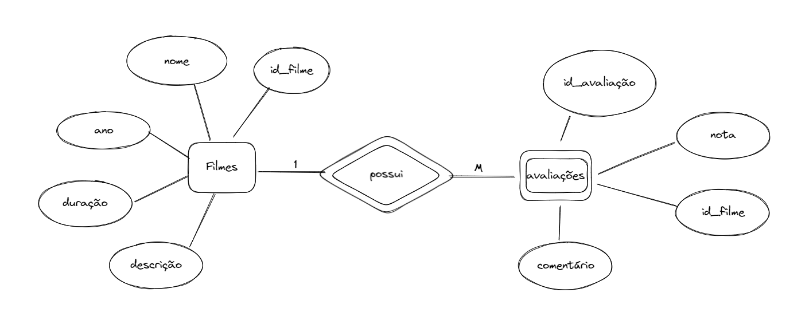
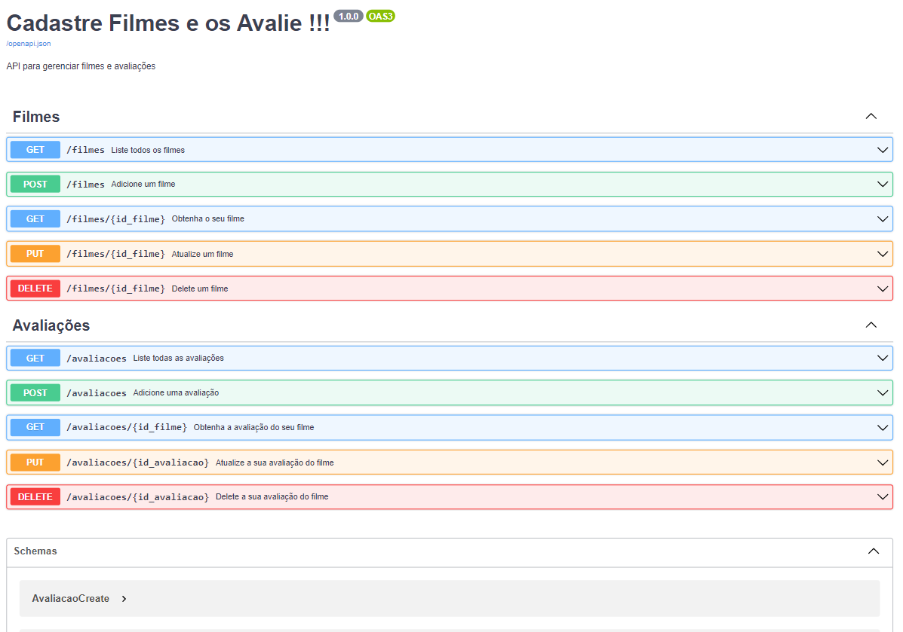

# API Gerenciadora de Filmes e suas respectivas Avaliações

Este é um projeto foi criado para que o usuário use uma api que possa fazer o cadastramento de filmes e o cadastramento de avaliações desses filmes. Além disso, foi utilizado todos os requisitos para o CRUD e o API RESTful. Veja abaixo o modelo de entidade-relacionamento desse gerenciamento:



Observe pelo modelo de entidade-relacionamento, que avaliações possui um forte dependência, pois sempre estará linkada a um filme. Entretanto, um filme pode estar linkado a várias avaliações.

Ademais, o projeto consiste em duas etapas, a primeira consolida suas informações em arquivos .txt sem a utilização de banco de dados. Veja abaixo:

### **Link para vídeo da primeira parte implementada:**
Nesse vídeo é possível encontrar requisitos adequados de práticas iniciais do uso da API e como utilizá-la no mundo real, como por exemplo, conexão com o front-end. <br>
https://www.youtube.com/watch?v=pYtyoPe8YtU

Nesse contexto, o projeto busca a melhores práticas do mercado, portanto, é importante a utilização de banco de dados. Logo, na segunda parte do projeto é utilizado `MySQL`, entretanto, qualquer outro database pode ser implementado. Visualize abaixo a segunda parte implementada e explicada:

### **Link para vídeo da segunda parte implementada:**
Nesse vídeo é possível encontrar requisitos adequados de práticas do uso da API conectadas a um banco de dados. <br>
https://youtu.be/c97G6mM7Quk

---
## Utilização do Projeto
Com isso, para rodar o projeto em sua máquina local siga as etapas abaixo:

1. Uitlize o prompt de comando para Clonar o repositório em um diretório da sua preferência:
```
git clone https://github.com/RicardoMourao-py/FastAPI_Filmes.git
```
2. Crie seu ambiente virtual no prompt
```
python -m venv name_env
```
3. Ative o seu ambiente virtual
```
name_env\Scripts\activate.bat
```
4. Instale todas suas dependências
```
pip install -r requirements.txt
``` 
5. Crie seu database com suas tabelas no seu DBMS(Database Management System) com a query abaixo:
```sql
CREATE DATABASE IF NOT EXISTS filmes;

USE filmes;

CREATE TABLE IF NOT EXISTS filmes (
    id_filme INTEGER PRIMARY KEY NOT NULL auto_increment,
    nome VARCHAR(255) UNIQUE NOT NULL,
    ano INTEGER NOT NULL,
    duracao FLOAT NOT NULL,
    descricao TEXT NOT NULL
);

CREATE TABLE IF NOT EXISTS avaliacoes (
    id_avaliacao INTEGER PRIMARY KEY NOT NULL auto_increment,
    comentario TEXT NOT NULL,
    nota FLOAT NOT NULL CHECK (nota >= 0 AND nota <= 10),
    id_filme INTEGER,
    FOREIGN KEY (id_filme) REFERENCES filmes(id_filme) ON DELETE CASCADE
);
```
6. Crie um arquivo `.env` no seu diretório com suas credenciais. Observe que o banco de dados utilizado é o `MySQL`, caso esteja utilizando outro, pesquise quais características seu arquivo `.env` deve ter e modifique o arquivo [database.py](sql_app/database.py) de acordo com as especificações. Caso esteja utilizando o mesmo, basta criá-lo com o seguinte conteúdo (lembre-se de adicionar o que está em branco):
```
DB_PROVIDER=mysql
DB_DRIVER=mysqlconnector
DB_DATABASE_NAME=filmes
DB_USER=
DB_PASSWORD=
DB_HOST=localhost
DB_PORT=3306
DB_CONNECTION_STRING=${DB_PROVIDER}+${DB_DRIVER}://${DB_USER}:${DB_PASSWORD}@${DB_HOST}:${DB_PORT}/${DB_DATABASE_NAME}
```
6. Execute o projeto
```
uvicorn main:app --reload
```
7. Abra o seu browser em: <br>
http://127.0.0.1:8000/docs <br>

Deve aparecer a seguinte tela:



<BR>

## <center>  SE DIVIRTA !!! </center>
